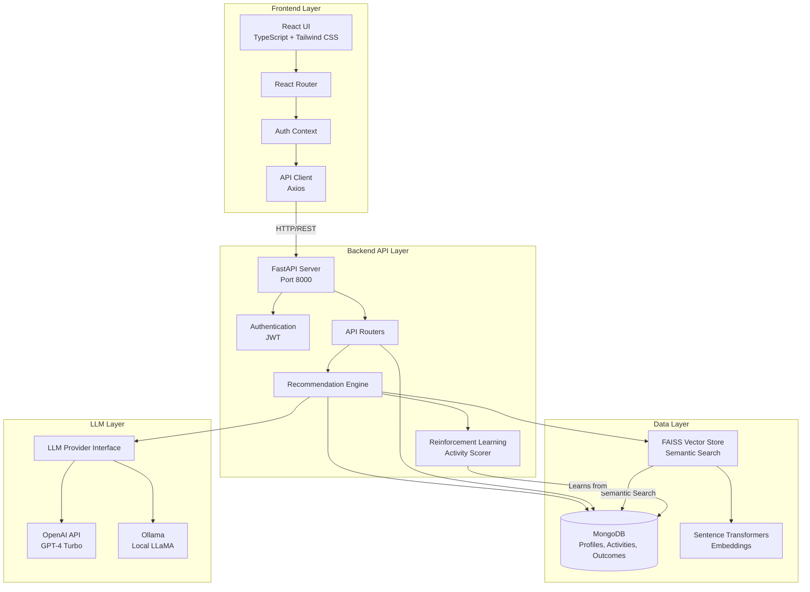

# Autism AI-Powered Cognitive Activity Recommender

A production-ready web application that recommends personalized cognitive activities for children with Autism Spectrum Disorder (ASD) based on child profiles, preferences, recent behavior, and past activity outcomes.

## Key Breakthroughs

- **RAG-Powered Recommendations**: Combines FAISS vector search with LLM enhancement for semantically-aware activity matching
- **Reinforcement Learning Integration**: Activity scoring system that learns from historical outcomes to improve recommendations over time
- **Multi-Provider LLM Architecture**: Flexible provider pattern supporting both cloud (OpenAI) and local (Ollama) LLM backends
- **Semantic Activity Search**: Vector embeddings enable understanding of activity context, goals, and child preferences beyond keyword matching
- **Real-time Personalization**: Dynamic recommendations based on current mood, attention level, and environmental context

## Features

- **Child Profile Management**: Create and manage detailed child profiles with communication level, cognitive level, sensory sensitivities, interests, triggers, and goals
- **Activity Library**: Comprehensive library of cognitive activities with detailed metadata (materials, steps, difficulty, sensory load, safety notes)
- **AI-Powered Recommendations**: Get personalized activity recommendations based on:
  - Child profile and preferences
  - Today's context (mood, attention level, environment)
  - Recent activity outcomes and feedback
- **Safety Constraints**: Automatic filtering to avoid activities that could trigger sensory overload or other concerns
- **Feedback Loop**: Log activity outcomes (engagement, stress, success) to improve future recommendations
- **Flexible LLM Integration**: Support for OpenAI API or local LLaMA models via provider pattern

## Tech Stack

### Backend
- **FastAPI** (Python) - REST API
- **MongoDB** - Database
- **Pydantic** - Data validation
- **Motor** - Async MongoDB driver
- **FAISS** - Vector similarity search
- **Sentence Transformers** - Semantic embeddings
- **OpenAI API** or **Local LLaMA** - LLM integration

### Frontend
- **React 18** - UI framework
- **TypeScript** - Type safety
- **Tailwind CSS** - Styling
- **Vite** - Build tool
- **React Router** - Navigation

## Prerequisites

- Python 3.9+
- Node.js 18+
- MongoDB (local or remote)
- OpenAI API key (if using OpenAI provider) OR local LLaMA endpoint (if using local provider)

## Quick Setup

### Backend

```bash
cd backend
python -m venv venv
venv\Scripts\activate  # Windows
# source venv/bin/activate  # macOS/Linux
pip install -r requirements.txt
cp .env.example .env
# Edit .env with your configuration
python run_seed.py  # Seed sample data
uvicorn app.main:app --reload --port 8000
```

### Frontend

```bash
cd frontend
npm install
npm run dev
```

## Architecture

### System Architecture Diagram



### Architecture Components

#### Frontend Layer
- **React 18**: Modern UI framework with hooks and context API
- **TypeScript**: Type-safe development
- **React Router**: Client-side routing and navigation
- **Auth Context**: Global authentication state management
- **API Client**: Type-safe HTTP client with Axios
- **Tailwind CSS**: Utility-first CSS framework

#### Backend API Layer
- **FastAPI**: High-performance async Python web framework
- **Authentication**: JWT-based user authentication and authorization
- **API Routers**: Modular route handlers for profiles, recommendations, outcomes
- **Recommendation Engine**: Core logic combining RAG, filtering, and LLM enhancement
- **Reinforcement Learning**: Activity scoring based on historical outcomes

#### Data Layer
- **MongoDB**: Document database storing:
  - User profiles and child profiles
  - Activity library
  - Activity outcomes and feedback
- **FAISS Vector Store**: Fast similarity search for semantic activity matching
- **Sentence Transformers**: Embedding model for semantic search (all-MiniLM-L6-v2)

#### LLM Layer
- **Provider Pattern**: Abstract interface supporting multiple LLM backends
- **OpenAI Provider**: GPT-4 Turbo for cloud-based recommendations
- **Ollama Provider**: Local LLaMA models (llama3.2:3b default) for privacy

### Data Flow

1. **User Request**: Frontend sends recommendation request with profile ID and context
2. **Authentication**: JWT token validated, user ID extracted
3. **Profile Retrieval**: Fetch child profile and recent outcomes from MongoDB
4. **Query Building**: Construct semantic search query from profile, context, and outcomes
5. **Vector Search**: FAISS performs semantic similarity search on activity embeddings
6. **Safety Filtering**: Apply filters (age, sensory sensitivity, triggers)
7. **RL Enhancement**: Reinforcement learning adjusts scores based on past outcomes
8. **LLM Enhancement**: Top candidates sent to LLM for personalized recommendations
9. **Response**: Structured activity plan returned to frontend
10. **Feedback Loop**: User logs outcomes, which improve future recommendations

## Dependencies

### Backend Dependencies

#### Core Framework
- **fastapi** (0.104.1): Modern, fast web framework for building APIs
- **uvicorn[standard]** (0.24.0): ASGI server for FastAPI

#### Database
- **pymongo** (4.6.0): MongoDB driver for Python
- **motor** (3.3.2): Async MongoDB driver
- **dnspython** (2.8.0): DNS toolkit for MongoDB connection strings

#### Data Validation
- **pydantic** (>=2.5.0,<3.0.0): Data validation using Python type annotations
- **pydantic-settings** (>=2.1.0,<3.0.0): Settings management using Pydantic

#### Environment & Configuration
- **python-dotenv** (1.0.0): Load environment variables from .env files

#### LLM Integration
- **openai** (1.3.7): OpenAI API client
- **httpx** (0.25.2): Async HTTP client for Ollama API

#### Authentication
- **python-jose[cryptography]** (3.3.0): JWT token encoding/decoding
- **passlib[bcrypt]** (1.7.4): Password hashing
- **python-multipart** (0.0.6): Form data parsing

#### Vector Search & ML
- **sentence-transformers** (2.2.2): Semantic embeddings for RAG
- **faiss-cpu** (1.7.4): Facebook AI Similarity Search for vector operations
- **numpy** (1.24.3): Numerical computing
- **pandas** (2.1.4): Data manipulation and CSV processing

### Frontend Dependencies

#### Core Framework
- **react** (^18.2.0): UI library
- **react-dom** (^18.2.0): React DOM renderer

#### Routing & Navigation
- **react-router-dom** (^6.20.0): Declarative routing for React

#### HTTP Client
- **axios** (^1.6.2): Promise-based HTTP client

#### UI Components
- **react-icons** (^4.12.0): Popular icons library

#### Development Dependencies
- **typescript** (^5.2.2): TypeScript language
- **vite** (^5.0.0): Next-generation frontend build tool
- **@vitejs/plugin-react** (^4.2.0): Vite plugin for React
- **tailwindcss** (^3.3.5): Utility-first CSS framework
- **postcss** (^8.4.31): CSS post-processor
- **autoprefixer** (^10.4.16): CSS vendor prefixing
- **eslint** (^8.53.0): JavaScript/TypeScript linter
- **@typescript-eslint/parser** (^6.10.0): TypeScript ESLint parser
- **@typescript-eslint/eslint-plugin** (^6.10.0): TypeScript ESLint plugin
- **@types/react** (^18.2.37): TypeScript types for React
- **@types/react-dom** (^18.2.15): TypeScript types for React DOM

### External Services

- **MongoDB**: Document database (local or cloud)
- **OpenAI API** (optional): Cloud-based LLM service
- **Ollama** (optional): Local LLM runtime for privacy-focused deployments

## Project Structure

```
cognitive_plan/
├── backend/
│   ├── app/
│   │   ├── __init__.py
│   │   ├── main.py              # FastAPI app
│   │   ├── config.py            # Configuration
│   │   ├── database.py           # MongoDB connection
│   │   ├── schemas.py            # Pydantic models
│   │   ├── llm_providers.py     # LLM provider pattern
│   │   ├── recommendation_engine.py  # Recommendation logic
│   │   ├── vector_store.py      # FAISS vector store
│   │   ├── reinforcement_learning.py  # RL activity scorer
│   │   ├── seed_data.py         # Sample activities
│   │   └── routers/
│   │       ├── profiles.py
│   │       ├── activities.py
│   │       ├── recommendations.py
│   │       └── outcomes.py
│   ├── requirements.txt
│   └── .env.example
├── frontend/
│   ├── src/
│   │   ├── api/
│   │   │   └── client.ts         # Type-safe API client
│   │   ├── components/
│   │   │   ├── Navbar.tsx
│   │   │   ├── ProfileCard.tsx
│   │   │   ├── ProfileModal.tsx
│   │   │   ├── RecommendationCard.tsx
│   │   │   ├── RecommendationForm.tsx
│   │   │   └── OutcomeModal.tsx
│   │   ├── pages/
│   │   │   ├── Dashboard.tsx
│   │   │   ├── ProfileDetail.tsx
│   │   │   └── ActivityLibrary.tsx
│   │   ├── types.ts              # TypeScript types
│   │   ├── App.tsx
│   │   └── main.tsx
│   ├── package.json
│   └── vite.config.ts
└── README.md
```
