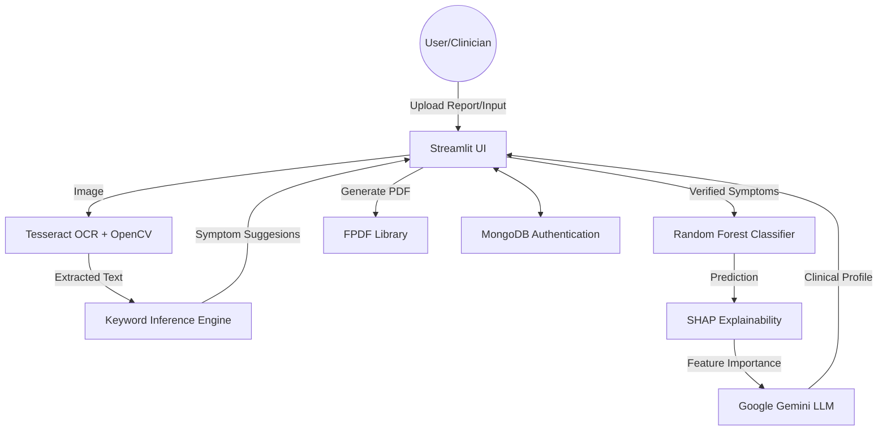

# Autism DSM-5 Severity Classifier

A comprehensive, AI-driven application designed to assist in the assessment and profiling of autism severity levels based on DSM-5 criteria.

## 🚀 Major Updates & Breakthroughs

- **Multi-Modal Symptom Detection**: Combines automated OCR (Tesseract + OpenCV) to extract clinical insights from therapy reports with manual user verification.
- **Explainable AI (XAI) Integration**: Uses **SHAP (SHapley Additive exPlanations)** to provide transparency, showing exactly which symptoms drove the severity prediction.
- **Generative AI Clinical Profiling**: Integrates **Google Gemini (2.0/2.5 Flash)** to translate complex model outputs and XAI data into accessible, professional patient profiles.
- **Secure Clinical Portal**: Robust authentication system using **MongoDB** and **bcrypt** hashing to ensure patient data privacy and secure access.
- **Professional PDF Export**: One-click generation of formatted clinical reports for documentation and sharing, handled via the **FPDF** library.

## 🏗️ Architectural Diagram



## 🛠️ Key Dependencies

The project relies on the following core technologies:

- **Frontend**: `streamlit`
- **Data Processing**: `pandas`, `numpy`
- **Machine Learning**: `scikit-learn`, `joblib`
- **OCR & Vision**: `pytesseract`, `opencv-python`, `Pillow`
- **Explainability**: `shap`, `matplotlib`
- **Generative AI**: `google-generativeai`
- **Database & Auth**: `pymongo`, `bcrypt`, `python-dotenv`
- **Reporting**: `fpdf`

## ⚙️ Installation & Setup

1. **Environment Variables**:
   Create a `.env` file based on `.env.example`:
   ```env
   GEMINI_API_KEY=your_gemini_key
   MONGO_URI=your_mongodb_uri
   ```

2. **Tesseract OCR**:
   Ensure Tesseract-OCR is installed on your system and the path is correctly set in `app.py`.

3. **Install Dependencies**:
   ```bash
   pip install -r requirements.txt
   ```

4. **Run Application**:
   ```bash
   streamlit run app.py
   ```
